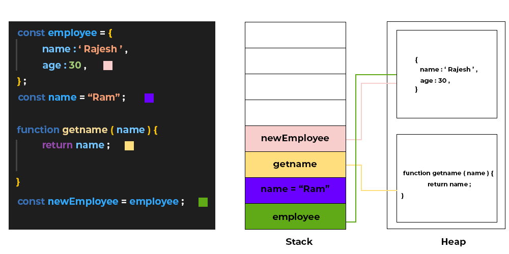

## Stack & Heap Memory

- There are mainly two types of memory: stack & heap.

- Stack is used for primitive and it gives a copy of the variable not its reference.

- Heap is used for non-primitive and it gives the reference of the variable.

- Below is a image so you can get better understanding of the memory management.

### Memory in Stack & Heap

